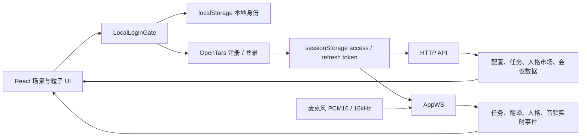

# Agent1 B Version 项目交接文档

> 更新时间：2026-07-24  
> 项目目录：`/Users/d4nn9/Documents/前端南山`  
> GitHub：`https://github.com/Asbeel24/agent1`  
> 当前分支：`B-Version`  
> 当前提交：`dc85132 fix: connect B Version to live OpenTars`  
> 当前状态：代码、测试和构建已通过，`B-Version` 已推送至 GitHub。

## 1. 项目目标

Agent1 是一个以粒子球为主要视觉入口的语音 Agent 前端。产品方向由三部分组成：

1. 以 `agent1-dev.bicamind.xyz` 的功能框架为基础。
2. 以 `rogierdeboeve.com` 的视觉节奏、排版和滑动手感为参考。
3. 使用本项目自己的 Three.js / WebGL GPU 粒子球，不直接复制参考站点的 Shader。

当前前端包含四个主要场景：

- 翻译
- 主场
- 会议
- 人格市场

B Version 的核心目标不是改视觉，而是让这套前端能被
`0xdenny218/opentars` 后端直接接入和继续开发。

## 2. 当前整体状态

### 已完成

- React + Vite + TypeScript 项目结构。
- Three.js GPU 粒子球、背景网格、响应式布局。
- 四个场景的横向拖拽/滑动切换。
- 切换场景时复用同一个粒子系统，通过 preset 平滑变形，不重新创建球体。
- 会议场景的纵向切换：粒子球视图与黑底白字文本视图。
- 会议文本视图打开时锁定横向场景切换，返回球体后恢复。
- 点击球体/录音控件开始录音，显示录音状态和计时。
- 录音开始、结束提示音，带尾部淡出和混响。
- 麦克风音量驱动粒子球 Level Gamma。
- 鼠标吸引粒子，吸引强度和速度已弱化。
- 移动端翻译语言选择界面和多断点适配。
- 本地持久化访客身份和登录界面。
- OpenTars HTTP API、AppWS、鉴权、令牌刷新、实时音频和事件协议对齐。
- B Version 默认使用真实开发后端，不再默认 mock。
- 本地开发 REST 通过 Vite 代理解决浏览器 CORS。
- AppWS 已实测连接成功并保持在线。

### 尚未完整闭环

- 需要真人允许麦克风权限并说话，完成一次完整的实时语音上行、服务端响应和下行音频验收。
- 会议录音的 WAV/TOS 上传管线尚未接到现有录音按钮。
- 当前 GitHub 推送不会自动部署；生产部署链路还未配置。

## 3. 工作过程概览

### 阶段一：视觉原型和交互框架

- 搭建黑色全屏视觉系统、品牌信息、导航、状态面板和响应式布局。
- 将本地 Lumina GPU 粒子球作为主视觉。
- 增加低亮度渐变网格，修复 Shader 画布与页面背景色差。
- 多轮调整球体尺寸、画布边界和相机缩放，解决粒子被 Shader 容器裁切的问题。
- 优化左下角标题、字体、场景信息层级和移动端显示。

### 阶段二：场景与手势

- 完成翻译、主场、会议、人格市场四个 preset。
- 从“刷新/重建粒子球”改成同一粒子系统内的 preset 插值。
- 优化左右拖拽阈值、惯性、回弹和 0.2–0.5 秒场景文字过渡。
- 修复人格市场滑到翻译时一次手势触发两次的问题。
- 阻止浏览器边缘滑动抢占应用内左滑。
- 会议增加纵向文本视图，并分离“进入会议场景”和“打开会议文本”两类动画状态。

### 阶段三：录音和声音反馈

- 点击粒子球可开始/结束录音。
- 增加录音计时、粒子变暗和状态文案。
- 接入 `record sfx1.mp3` 和 `record sfx2.mp3`。
- 对提示音增加尾部淡出、混响和 mixing 调整，减少 clipping。
- 麦克风音量映射 Level Gamma：声音越大越接近 `0.74`，越小越接近 `1.96`。
- 录音结束后停止音频分析，避免残留音量继续驱动粒子动画。

### 阶段四：代码整理和接口契约

- 将过大的 `App.tsx` 拆分为 feature 组件、hooks、services 和 API 层。
- 依据 OpenTars Swagger 与 Go AppWS 实现，而不是继续根据旧用户旅程猜测协议。
- 建立 HTTP 客户端、令牌存储/刷新、AppWS 客户端、协议运行时校验和契约检查脚本。
- 建模任务、人格、翻译、会议、会议资产、会议分享和上传会话接口。
- 保留前端视觉和既有交互，只替换数据及通信层。

### 阶段五：B Version 真实后端联调

后端反馈“没有收到实时请求”后，定位到以下原因：

1. 本地环境没有 `VITE_OPENTARS_*` 配置，旧逻辑使 `liveApiEnabled=false`。
2. 之前的假登录只写入 localStorage，没有调用后端注册或登录。
3. 没有 access token 时，实时连接 hook 会直接退出。
4. 浏览器本地访问后端 REST 会被 CORS 拦截。
5. 推送 GitHub 不等于部署，线上域名仍然运行另一套应用。

修复方案：

- B Version 在非测试环境默认 live。
- 本地随机身份自动映射为真实 OpenTars 测试账号。
- 启动时依次尝试恢复 token、登录、注册、重复邮箱后再登录。
- access/refresh token 写入 sessionStorage。
- 本地 REST 使用 `/opentars-api` Vite 代理。
- WebSocket 直接连接 `wss://agent1-dev-api.bicamind.xyz/ws`。
- Header 展示真实 AppWS 状态。
- 修复原生 `fetch` 被解绑定后导致的 `Illegal invocation`。
- 对 React StrictMode 的重复认证请求做 Promise 去重。

## 4. 当前运行架构



### 开发环境端点

| 类型 | 地址 |
| --- | --- |
| HTTP 后端 | `https://agent1-dev-api.bicamind.xyz` |
| 本地 HTTP 路径 | `/opentars-api`，由 Vite 代理转发 |
| AppWS | `wss://agent1-dev-api.bicamind.xyz/ws` |
| 后端健康检查 | `/healthz`、`/readyz` |
| 目标 Web 域名 | `https://agent1-dev.bicamind.xyz` |

注意：目标 Web 域名在最后一次检查时展示的是另一套 BicaBud 应用，并不是本仓库的
B Version。GitHub 分支已经更新，但还没有部署到该域名。

## 5. 登录、身份和数据隔离

登录界面目前是“本地访客身份 + 真实后端测试会话”的过渡方案。

### 本地身份

- localStorage key：`agent1.local_identity.v1`
- 包含：
  - `schema_version`
  - 本地 `user_id`
  - 随机邮箱：`visitor-<随机值>@local.agent1`
  - 24 位随机密码
  - `created_at`
- 不刷新、不清理浏览器数据时，身份会持续保留。
- 业务数据可以使用 `agent1.user.<user_id>.*` 做用户级隔离。

### 后端会话

- 启动时使用本地邮箱和密码访问真实 OpenTars。
- 若现有 access token 可调用 `/v1/me`，直接恢复。
- 否则尝试 login；无账号时 register；邮箱已存在时再次 login。
- access token 和 refresh token 放在 sessionStorage，不写入交接文档或日志。

这不是最终账号系统，但已经能为真实 API 和 AppWS 联调提供稳定、隔离的测试身份。

## 6. OpenTars 接口接入情况

### 已接入并实现客户端

- 公共配置：`GET /v1/config`
- 注册、登录、刷新、登出和当前用户
- 当日任务和日期范围任务
- 任务状态、取消、建议决策
- 人格分身读取、生成、改名、发布、取消发布
- 人格市场读取
- 会议设置
- 会议列表、详情、转写、总结
- 会议资产、分享和公开分享
- 会议上传会话、凭证续期、完成和终止
- AppWS 建连、鉴权、心跳、重连和撤销会话处理
- 翻译 start / stop
- 人格选择
- 实时 PCM 音频 append / commit
- 实时下行音频、interrupt 和反馈
- 任务实时状态事件

### UI 中已经实际使用

| 功能 | 数据来源 | 状态 |
| --- | --- | --- |
| 启动认证 | OpenTars Auth HTTP | 已接入 |
| 语言和合法语言对 | `/v1/config` | 已接入 |
| 人格选项 | `/v1/config` | 已接入 |
| 人格市场 | `/v1/persona-twins/market` | 已接入只读展示 |
| 任务抽屉 | HTTP tasks | 已接入 |
| 翻译场景切换 | AppWS | 已接入 |
| 人格选择 | AppWS | 已接入 |
| 实时录音 | AppWS PCM16 | 已实现，待真人语音闭环验收 |
| 会议内容 | Meeting HTTP API | 客户端已实现，UI 接线未完整 |
| 会议录音上传 | WAV + TOS | API 已实现，浏览器上传管线未接 |

## 7. 重要协议决定

- AppWS 信封使用 `{ id?, event, data? }`，不是旧的 `{ type, data }`。
- 浏览器 WebSocket 通过 `?access_token=<encoded-token>` 鉴权。
- AppWS 每 30 秒发送 `client.ping`。
- 断线重连使用 1、2、4、8 秒上限的抖动退避。
- 实时语音使用 PCM16、单声道、16000Hz、Base64 JSON。
- 录音结束发送 `client.input.audio.commit`。
- 会议录音不走 AppWS；按后端协议使用 WAV/TOS 上传。
- HTTP 是任务最终状态和断线恢复的权威来源。
- 语言和人格选项来自 `/v1/config`，不应写死。
- 不在日志中输出 token、带 token 的完整 WebSocket URL 或 TOS 临时凭证。

## 8. 本地启动

```bash
cd /Users/d4nn9/Documents/前端南山
git fetch origin
git checkout B-Version
git pull --ff-only origin B-Version
npm install
npm run dev -- --host 127.0.0.1 --port 4174
```

浏览器打开：

```text
http://127.0.0.1:4174/
```

端口 `5173` 在当前机器上曾被 Frameboard/MKBOARD 占用，因此本项目约定使用 `4174`。

### 模式配置

B Version 在非测试环境默认使用真实后端，通常不需要额外 `.env`。

强制使用 mock：

```env
VITE_OPENTARS_API_MODE=mock
```

覆盖端点：

```env
VITE_OPENTARS_API_BASE_URL=https://agent1-dev-api.bicamind.xyz
VITE_OPENTARS_WS_URL=wss://agent1-dev-api.bicamind.xyz/ws
```

不要提交真实 token。

## 9. 验证方式和最后结果

```bash
npm test
npm run typecheck
npm run build
```

最后一次完整验证结果：

- 17 个测试文件通过。
- 55 个测试通过。
- TypeScript typecheck 通过。
- production build 通过。
- 只有主 JS 约 888 KB、超过 500 KB 的构建警告，不影响构建产物。

真实开发后端验证：

- 自动注册/登录成功。
- `/v1/config` 可读取。
- 后端返回 4 个内置人格。
- 人格市场返回 45 个 profile。
- Header 显示 `AppWS live / B ONLINE`。
- 切换人格后连接保持 live。
- 切到翻译场景后连接保持 live，翻译模式事件能够发送。
- 点击录音进入浏览器真实麦克风授权请求。

尚缺的一条验收证据：允许麦克风后实际说话，确认后端收到
`client.input.audio.append`、`client.input.audio.commit` 并返回音频。

## 10. 已知边界和风险

### P0：继续工作时优先处理

1. **实时语音端到端验收**  
   需要真人允许麦克风权限并说话，同时观察前端 AppWS、后端日志和返回音频。

2. **会议录音上传接线**  
   后端要求 WAV / PCM16 / 16kHz / mono，通过 TOS SDK 和会议上传会话完成。
   不能把会议录音错误发送给实时 Agent AppWS。

3. **生产部署与 CORS**  
   仓库当前没有完整自动部署工作流。新域名直连 REST 时，需要后端把准确 origin
   加入 CORS，或使用同源服务端代理。

### P1：后续优化

1. 主包约 888 KB，可将 Three.js、Shader 和非首屏场景做动态拆包。
2. 给 AppWS 和实时音频增加开发态可视化诊断，但必须隐去 token。
3. 增加 token 过期、刷新失败和后端离线的 UI 回归测试。
4. 将会议列表、转写、总结和上传流程接入正式 UI。
5. 清理仍未使用的 `src/services/chat.ts` mock。
6. `src/services/scenes.ts` 是 UI preset 配置，可以保持静态，不应误认为后端 mock。

## 11. 文档现状与注意事项

优先阅读：

- `docs/PROJECT_HANDOFF_2026-07-24.md`：本文件，当前状态总览。
- `docs/AGENT1_INTERFACE_CONTRACT.md`：协议基线和安全约束。
- `docs/B_VERSION_API_ALIGNMENT.md`：接口覆盖矩阵和旧协议差异。
- `docs/BACKEND_INTERFACE_GAPS.md`：历史缺口记录。

注意：`B_VERSION_API_ALIGNMENT.md` 中“没有 token 时回退 mock”和“不增加登录 UI”等文字是
较早阶段的记录。当前实现已经变为默认 live，并已有 LocalLoginGate。发生冲突时以本文件、
`src/api/runtime.ts` 和 `src/auth/backendSession.ts` 为准。

## 12. 关键代码入口

| 文件 | 作用 |
| --- | --- |
| `src/App.tsx` | 应用装配和主要状态协调 |
| `src/features/auth/LocalLoginGate.tsx` | 本地身份入口和后端认证门 |
| `src/auth/localIdentity.ts` | 本地身份生成、持久化和 scoped key |
| `src/auth/backendSession.ts` | 恢复、登录或注册真实后端会话 |
| `src/api/runtime.ts` | live/mock、HTTP 和 AppWS 端点 |
| `src/api/httpClient.ts` | Bearer、刷新、错误解析 |
| `src/api/agent1Api.ts` | OpenTars HTTP 业务接口 |
| `src/api/appWsClient.ts` | WebSocket、心跳和重连 |
| `src/protocol/agent1.ts` | AppWS 类型和运行时判别 |
| `src/hooks/useAgent1Realtime.ts` | 场景事件、实时录音和服务器事件 |
| `src/hooks/useMicrophoneInput.ts` | 采样、降采样和 PCM16 |
| `src/hooks/useGestureEngine.ts` | 横向场景和会议纵向手势 |
| `src/hooks/useMeetingTransition.ts` | 会议球体/文本动画状态 |
| `vite.config.ts` | 本地 OpenTars REST 代理 |
| `scripts/check-opentars-contract.mjs` | Swagger 契约检查 |

## 13. 关键提交

| Commit | 内容 |
| --- | --- |
| `dc85132` | B Version 连接真实 OpenTars、自动认证、本地代理 |
| `c3ec5bc` | 本地持久化身份登录 |
| `b26c36c` | 完成 OpenTars 后端契约对齐 |
| `ae9e19e` | 建立 B Version API / AppWS 接入 |
| `6fe05b5` | 拆分 App.tsx，整理服务层、hooks 和 feature 组件 |
| `7026d0b` | 调整录音提示音混响 |
| `6d322c5` | 替换录音提示媒体 |
| `9a0c4c8` | 统一 Shader 与页面背景 |
| `af468a0` | 移动端显示语言控制 |
| `c6103b8` | 定义 Agent1 接口并完善交互 |
| `a59c842` | 初始 Agent1 presence interface |

## 14. 换环境后的恢复清单

1. 克隆 `https://github.com/Asbeel24/agent1`。
2. 切换 `B-Version`，确认 HEAD 至少为 `dc85132`。
3. 阅读本文件和接口契约。
4. 安装依赖并运行测试、typecheck、build。
5. 打开 `http://127.0.0.1:4174/`。
6. 确认登录后 Header 显示 AppWS live。
7. 允许麦克风，完成真实语音闭环验收。
8. 若部署到新域名，先确认后端 CORS 和反向代理策略。
9. 开始会议上传功能前，先阅读后端 TOS 上传协议，不要复用 AppWS 实时音频管线。

## 15. 可直接交给下一位开发者/Agent 的任务说明

```text
请继续维护 Agent1 的 B-Version 分支。
先阅读 docs/PROJECT_HANDOFF_2026-07-24.md、
docs/AGENT1_INTERFACE_CONTRACT.md 和 docs/B_VERSION_API_ALIGNMENT.md。

保持现有视觉、Shader、粒子球和场景交互不变。当前最高优先级：
1. 完成真实麦克风 -> AppWS PCM16 -> 后端响应音频的端到端验收；
2. 将会议模式录音接到 OpenTars WAV/TOS 上传会话；
3. 配置生产部署和正确的 CORS/同源代理。

开始改动前先运行 npm test、npm run typecheck、npm run build。
不要提交 token、随机本地账号密码或 TOS 临时凭证。
```

## 12. 会议录音上传链路（2026-07-24 补充）

针对优先级 2「会议模式录音接到 OpenTars WAV/TOS 上传会话」的工作已完成阶段性落地。本次改动在保留原有视觉、粒子球和场景交互的前提下，把会议场景从"录音帧被丢弃"修复为"OPFS 暂存 → TOS 直传 → 云端 transcript + summary"。

### 关键文件

| 操作 | 路径 |
| --- | --- |
| 新建 | `src/services/meeting/opfsStorage.ts` — `OpfsMeetingRecordingStorage` 与路径段校验 |
| 新建 | `src/services/meeting/wavRecorder.ts` — `MeetingRecorder` + 44 字节 PCM16/16kHz/mono WAV 头 + 分块 SHA-256 |
| 新建 | `src/services/meeting/tosUploader.ts` — `createTosMeetingUploader`，封装 `@volcengine/tos-sdk`，20MB × 3 任务、断点续传、pause/abort |
| 新建 | `src/services/meeting/uploadPipeline.ts` — `createMeetingUploadPipeline` 编排器，纯函数无 React 依赖，可单测 |
| 新建 | `src/services/meeting/index.ts` — barrel 出口 |
| 新建 | `src/services/meeting/__tests__/{opfsStorage,wavRecorder,tosUploader,uploadPipeline}.test.ts` |
| 新建 | `src/hooks/useMeetingUpload.ts` — React hook 状态机：`idle → recording → finalizing → uploading → finished → idle`（3 秒后回归空闲） |
| 新建 | `src/hooks/__tests__/useMeetingUpload.test.ts` |
| 修改 | `package.json` — 新增 `@volcengine/tos-sdk` 与 `@noble/hashes` |
| 修改 | `src/App.tsx` — 场景路由：`sceneId === 'meeting'` 时 PCM 帧走到 `meetingUpload.appendPcm`，否则仍走 `sendAudioFrame` |
| 修改 | `src/features/chat/MeetingTranscript.tsx` — `meetingId` 存在时拉 `getTranscript` + `getSummary`，回退到上传进度展示 |
| 新建 | `src/features/chat/__tests__/MeetingTranscript.test.tsx` |

### 协议步骤

1. 用户进入「会议」场景，点击粒子球 → `useMeetingUpload.start()`：
   - 校验登录态（`readLocalIdentity()` 返回 `user_id`）；
   - 在 OPFS 创建 `opentars/meeting-recordings/{ownerUserId}/{recordingId}/audio.wav`，写入 44 字节 WAV 头。
2. `useMicrophoneInput` 的 PCM 帧（16-bit / 16kHz / mono）通过 `appendPcm` 写到 OPFS；
   - WAV header 中的 `data` 大小在写入过程中是占位的，停止时才被校正。
3. 点击粒子球结束录音 → `stopAndUpload`：
   - 从 OPFS 读取录制文件，分块 SHA-256（默认 1 MiB，最大 4 MiB）；
   - 以 `Idempotency-Key: <file_sha256>` 调用 `POST /v1/meeting-uploads`，得到 `upload_id` 与 TOS 临时凭证；
   - 调用 `@volcengine/tos-sdk` 多分片上传（20MB × 3 任务），校验 `endpoint` 必须 `https:`，`provider === 'tos'`；
   - 上传成功后 `POST /v1/meeting-uploads/{upload_id}/complete`；
   - 3 秒后 UI 自动回到 idle，期间展示 `meeting_id` 与总进度。
4. `MeetingTranscript` 拿到 `meeting_id` 后调用：
   - `GET /v1/meetings/{id}/transcript`
   - `GET /v1/meetings/{id}/summary`
   渲染时间戳、要点、行动项、原始转写。任一失败回退到本地上传文案。
5. 暂停：取消 SDK 上传、保留 `tos-upload-checkpoint.json`，UI 标红；恢复时再走相同管线。
6. 终止：`abortMultipartUpload` + `DELETE /v1/meeting-uploads/{id}` + 删除 OPFS 录制文件。

### 运行与本地调试

```bash
npm test                          # 23 文件，108 用例全过
npm run typecheck                 # tsc 严格通过
npm run build                     # vite build 成功（含 1.1 MB index 包，因为 TOS SDK 体积）
npm run dev                       # 在 http://localhost:5173 进入「会议」场景
```

在 dev server 中：
- 用测试账号登录（`localStorage` 写入 `user_id` 即可被 `readLocalIdentity` 识别）。
- 在 OPFS 中可以看到 `opentars/meeting-recordings/<user_id>/recording-*.wav`、`manifest.json`、`tos-upload-checkpoint.json`。
- DevTools 的 Application 面板可观察上传分片进度。
- 后端未返回 `storage` 字段时，hook 会直接 throw「服务端未返回 TOS 上传凭证」并停留在 `failed` 状态。

### 验收清单

- `npm test && npm run typecheck && npm run build` 全过；
- 「会议」场景点球开始录音 → 出现 `recording`，OPFS 写入；
- 再次点球结束 → `finalizing → uploading → finished`，3 秒后回到 `idle`；
- `MeetingTranscript` 在 `meeting_id` 存在时显示云端时间戳与标题，而不是写死的"23 JUL · 14:10"文案；
- 关闭 tab → 重开 → 未完成录音可以从 OPFS 断点续传；
- `terminate` 删除 OPFS 文件并打到 `DELETE /v1/meeting-uploads/{id}`。

### 推送策略

按用户要求，本改动暂不主动 push。等用户在本地完成"录音 → 上传 → 看到云端 transcript/summary"端到端验收后，再按规范拆分为两笔 commit 推到 `B-Version`：

1. `feat: wire meeting recording to OpenTars TOS upload`
2. `refactor: source MeetingTranscript from cloud transcript and summary`

## 13. 双向链路验证（2026-07-25）

`0xdenny218/opentars` 后端 + `Asbeel24/agent1` B-Version 前端之间的公开接口在真实线上环境中跑了一次。结论：**B-Version 走默认 dev 后端 `agent1-dev-api.bicamind.xyz` 的链路是稳的**，只有两条小坑需要前端或者 dev 后端补。

### 测试方法

- 真实环境：双方都是 public 公网部署，没有本地 compose 起 PG/Redis/TOS。
- 工具：直接 `curl` 对 `https://agent1-dev-api.bicamind.xyz` 跑测试账号注册 + 鉴权调用 + Swagger 比对。
- 验证目标：覆盖 B-Version 真实调用的接口路径，而不是后端代码里有但前端用不到的全集。

### 哪些链路通了

| Endpoint | Method | 状态 | 备注 |
|---|---|---|---|
| `/v1/config` | GET | 200 | 返回完整 voice / language / profile 配置 |
| `/v1/auth/register` | POST | 200 | 返回 access_token / refresh_token / user |
| `/v1/auth/login` | POST | 200 | 已注册账号重登可用 |
| `/v1/me` | GET | 200 | 鉴权 + 当前会话回读 |
| `/v1/meetings` | GET | 200 | 空列表 |
| `/v1/meeting-settings` | GET | 200 | |
| `/v1/persona-twins/market?limit=5` | GET | 200 | 真实市场条目（林序、Mia Chen 等） |
| `/v1/tasks?date=...&timezone=Asia/Shanghai` | GET | 200 | 空任务列表 |
| `/ws` WebSocket upgrade | GET | 101/401 | 仅握手；前端持 Bearer 通过 query 鉴权 |

### 需要注意的两条小坑

1. **`/v1/tasks` 必须带 `timezone` IANA 名**，否则 400 `invalid_timezone`。
   前端 `agent1Api.getTasks` 实际构造请求时已经在 `queryString(input)` 里塞 timezone，curl 不带参数才看到 400，这条对前端 **不是问题**。
2. **`/v1/persona-twin`（当前用户自有人格）在 dev 后端返回 404**。当前 OpenTars main 的 `server/bootstrap/bootstrap.go` 已注入对应 handler，因此这更可能是 dev 部署版本、启动装配路径或网关转发与当前 main 不一致。
   `getPersonaTwin` 在 `agent1Api.ts` 定义但**没有被当前 UI 调用**，所以基础页面暂不受影响；后端需通过部署 commit SHA 与路由 smoke test 定位原因。

### 端口与 CORS 现状

- 后端 HTTP 端口：`18888`（配置文件），dev 公网域名反向代理到 `https://agent1-dev-api.bicamind.xyz`。
- 前端 Vite dev 代理：`/opentars-api` → `https://agent1-dev-api.bicamind.xyz`（仅本地 dev 用）。
- 前端 Vercel 部署：B-Version 默认 `runtime.ts` 写死 fallback 到 `https://agent1-dev-api.bicamind.xyz`，所以 Vercel 构建出来直接调公开域名，不需要 CORS 中转。
- CORS：dev 后端对同源没问题；以后 Vercel 部署出独立域名时，要在后端 TOML 的 `[cors.allowed_origins]` 加上 Vercel 域名，否则浏览器会拦截。

### 给 Braden（Vercel 端）的一次性核对

1. 在 Vercel 项目 `lumina-voice-orb` 上面把 `VITE_OPENTARS_*` 留空即可，runtime fallback 会自动指向 `agent1-dev-api.bicamind.xyz`。
2. 如果后端 CORS 没自动放行 Vercel 预览域名，dev 后端 TOML 加 `cors.allowed_origins = ["https://lumina-voice-orb.vercel.app"]`。
3. 部署后用新注册账号试一次 `/v1/me` 确认跨域 fetch + Bearer header 工作正常。

### 截图与方法学

| 步骤 | 期望 |
|---|---|
| `POST /v1/auth/register` 随机本地邮箱 | 返回 200 + access_token |
| `GET /v1/me` | 返回 user + auth_session |
| `GET /v1/persona-twins/market?limit=5` | 返回 5 条真实条目 |
| `GET /v1/tasks?date=...&timezone=Asia/Shanghai` | 返回 `{"tasks":[], "total":0}` |
| `GET /v1/meetings` | 返回空列表 |
| `GET /v1/persona-twin` | 当前返回 404，未被 UI 使用，可接受 |

## 14. 人格市场接口现状（2026-07-25）

把 `/v1/persona-twins/market` 从 `server/httpserver/router.go` 拆出来看了一遍——HTTP 层已经完整，但**作为 demo** 还有几块没闭环。

### 已经做完的

| 层 | 文件 | 状态 |
|---|---|---|
| HTTP 路由 + 入参解析 | `server/personatwins/handler.go:206 Market` | OK，支持 `limit`、`cursor` |
| Service 校验与游标编解码 | `personatwin/service.go:144 ListMarket` | OK，默认 20/页、限上限、`use_count` 倒序游标 |
| PG 持久化 | `server/stores/postgres/persona_twin_store.go:161 ListMarket` | OK，`is_published=true` 过滤 |
| 表结构 | `migrations/postgres/0015_persona_twins.up.sql` | OK |
| MarketItem schema | `personatwin/types.go:80` | OK，6 个字段 |

也就是说，对一个**有数据的 PG 库**，HTTP 调用一切正常；响应与 `MarketItem` JSON shape 与 curl 实测结果一致。

### 没有完成（demo 缺口）

1. **没有 INSERT seed migration**：`0015_persona_twins.up.sql` 只 `CREATE TABLE` / 索引 / 外键，**没有任何 seed insert**。
   - 你看到的 45 条人格（林序、Mia Chen…）来自 dev 部署历史的手工插入或 e2e seed——fresh 数据库起出来 market 是空的。
   - 想"开箱有数据"，要么写一份 `0016_persona_twins_seed.up.sql`，要么在 e2e harness 跑 `cmd/opentars-server-api-e2e/main.go`。
2. **`/v1/persona-twin`（自有人格）dev 实例返回 404**：当前 main 已在 bootstrap 注入对应 handler，但 dev 部署仍不可达。这条会阻塞 publish/unpublish 链路，需要先核对部署 commit、启动装配路径和网关转发。
3. **没有 use 入口**：market 排序列是 `use_count DESC`，但代码里没看到调用 `IncrementUseCount` 的位置。use_count 永远初始为 0，market 排序退化成 `created_at DESC`。
4. **没有命名的语义化"市场排序算法"**——就是 `ORDER BY use_count DESC, created_at DESC, id DESC`，文档里没写。

### 本地起后端人工测试：可行，但要一组硬依赖

`make dev-up-deps && make server-migrate-dev && make run-server-dev` 的依赖谱：

| 组件 | 来源 | 替代品 |
|---|---|---|
| PostgreSQL 16 | `docker compose up postgres` | Docker Desktop/OrbStack，无需凭据 |
| Redis 7 | `docker compose up redis` | 同上 |
| OpenClaw | `docker compose up openclaw` | `OPENCLAW_GATEWAY_PORT` 为空就不强校验 |
| 火山 TOS | `server.local.toml` `[object_storage]` | **不可替代**；启动期会对 bucket 做 PutObject + DeleteObject probe，缺凭据会 exit |
| 语音 provider | `core.local.toml` `[voice] enabled=false` 即跳过 | 不发语音可以不配 |
| Intent LLM | `core.local.toml` `[intent]` | 同上，persona-twin 不依赖 |

### 启起来之后的 curl 步骤

```bash
# 1. 准备 server.local.toml
make dev-config            # 拷贝 deploy/config/server.example.toml + core.example.toml
# 编辑 deploy/config/server.local.toml，只改 [object_storage]：
#   access_key = "AK..."
#   secret_key = "SK..."
#   bucket     = "bicamind-dev"  # 或你自己的桶
# 其余字段保持 dev 默认（http_addr=:8080, postgres=54329, redis=6389）

# 2. 起依赖
make dev-up-deps

# 3. 迁移
make server-migrate-dev

# 4. 跑 server（前台监听 :8080）
make run-server-dev

# 5. 注册 + 鉴权
TOK=$(curl -s -X POST -H 'Content-Type: application/json' \
  -d '{"email":"local-'$(date +%s)'@agent1.local","password":"pw-1234567890","display_name":"local","device":{"platform_family":"web","platform":"web","installation_id":"inst-'$(date +%s)'","device_name":"local","app_version":"1.0.0-b","push_token":""}}' \
  http://127.0.0.1:8080/v1/auth/register | python3 -c 'import sys,json;print(json.load(sys.stdin)["access_token"])')

# 6. market 接口（fresh 库应该返回空）
curl -s -H "Authorization: Bearer $TOK" 'http://127.0.0.1:8080/v1/persona-twins/market?limit=10'
```

### 前端对接

`src/api/agent1Api.ts:171` 已经实现 `getPersonaTwinsMarket({ limit, cursor })`，跟 service 字段一致。
**只要本地 server 起得来，`B-Version` 的"人格市场"页面就能直接读数据**，不需要前端改动。

### 建议

| 维度 | 建议 |
|---|---|
| 想验证市场分页 / 排序 / cursor | 起本地 opentars-server，跑 curl —— OK |
| 想看 demo 数据 | 起本地后**写一份 seed migration**，或直接 INSERT 几条固定人格 |
| 想验证 publish / unpublish 链路 | 必须先修 `/v1/persona-twin` 的 dev 实例 404 |
| 想验证 use_count | 先找到 IncrementUseCount 入口（如果有），没有就要先补 |
| B-Version 生产前端 | 当前不需要改任何代码，等后端把上面 4 条补齐 |

## 15. B-Version × OpenTars 全量对接可行性（2026-07-24）

### 最终结论

**可以对接，但当前只能作为“核心页面可运行、会议闭环待后端部署同步”的前端，不能把现有 dev 域名视为完整生产后端。**

- B-Version 与当前 OpenTars `main` 的 REST 路径、鉴权方式、请求字段和主要响应类型基本一致；不需要改端口，也不需要另写一层 API adapter。
- 当前公网 `https://agent1-dev-api.bicamind.xyz` 能支撑登录、配置、任务列表、人格市场和会议列表等基础页面。
- 会议录音闭环依赖的上传初始化、完成、transcript、summary 等端点虽然在当前仓库 `server/bootstrap/bootstrap.go:377-408` 全部注入，但公网 dev 实测仍有多条返回 404。因此，**源码具备能力不等于现有部署已经具备能力**。
- 要达到“流畅运行”，后端团队必须先把 dev 实例升级到与当前 main 一致的构建，并把 Vercel 域名加入 CORS；随后完成一次真实 TOS 上传到 transcript/summary 的端到端验收。

### 分层判断

| 层级 | 结论 | 证据 |
|---|---|---|
| HTTP 基址 | 对齐 | 前端默认 `https://agent1-dev-api.bicamind.xyz`；本地可用 Vite `/opentars-api` 代理 |
| 鉴权 | 对齐 | register/login 返回 token，后续请求使用 Bearer；线上 `/v1/me` 实测 200 |
| 基础 UI | 可运行 | config、tasks、persona market、meetings、meeting settings 实测可达 |
| 人格市场读取 | 可运行 | `/v1/persona-twins/market` 实测 200，前后端 cursor/limit 契约一致 |
| 自有人格管理 | 当前部署不完整 | 当前源码已注入 Get/Generate/Rename/Publish/Unpublish；dev 实测部分 404 |
| 会议录音上传 | 源码对齐，部署待验 | 前端已实现五个 `/v1/meeting-uploads*` 调用；后端 bootstrap 全部注入，但尚未完成真实公网 TOS 验收 |
| 转写与总结 | 当前部署阻塞 | B-Version 会调用 transcript/summary；dev 实测两条均 404，无法完成会议结果页 |
| WebSocket | 协议可对接 | `/ws` 存在，需携带 token；仍需浏览器长连接稳定性验收 |
| CORS | 部署条件 | Vercel 独立域名必须进入后端 `allowed_origins`，否则浏览器会在网络层拦截 |

### B-Version 实际页面依赖矩阵

| 前端能力 | Endpoint | 当前仓库 main | 公网 dev 实测 | 对页面的影响 |
|---|---|---:|---:|---|
| 配置加载 | `GET /v1/config` | 已注册 | 200 | 正常 |
| 注册 | `POST /v1/auth/register` | 已注册 | 200 | 正常 |
| 登录 | `POST /v1/auth/login` | 已注册 | 200 | 正常 |
| 会话恢复 | `GET /v1/me` | 已注册 | 200 | 正常 |
| 每日任务 | `GET /v1/tasks` | 已注册 | 200（参数正确时） | 正常；必须传 IANA timezone |
| 人格市场 | `GET /v1/persona-twins/market` | 已注册 | 200 | 正常 |
| 会议上传初始化 | `POST /v1/meeting-uploads` | 已注册 | 未完成有效 TOS 凭证验收 | 会议录音闭环风险 |
| 上传凭证刷新 | `POST /v1/meeting-uploads/{id}/credentials` | 已注册 | 未端到端验收 | 断点续传风险 |
| 上传完成 | `POST /v1/meeting-uploads/{id}/complete` | 已注册 | 未端到端验收 | 无法确认 meeting_id 生成 |
| 会议转写 | `GET /v1/meetings/{id}/transcript` | 已注册 | 404 | 结果页无法显示真实转写 |
| 会议总结 | `GET /v1/meetings/{id}/summary` | 已注册 | 404 | 结果页无法显示真实总结 |

### 为什么当前 dev 的 404 不能归因于当前源码

`server/httpserver/router.go` 对每个业务 handler 采用 nil 检查后注册；而当前 `server/bootstrap/bootstrap.go:357-410` 明确把 persona、meeting、upload、share 等 handler 全部传给 `NewRouter`。因此，同一域名出现“market 200、persona Get 404、transcript 404”的现象，最合理解释是：

1. dev 实例运行的构建早于当前 main，或部署工件未同步；
2. dev 实例不是由当前 `bootstrap.New` 路径装配；
3. 反向代理/网关只转发了部分路径。

不能再表述为“router.go 已有 Swagger，所以只是某个 handler 没注册”。应由后端通过部署 commit SHA、启动日志和网关路由表确认实际原因。

### 上线前必须完成的后端动作

1. 将 `agent1-dev-api.bicamind.xyz` 部署到明确的 OpenTars commit，并暴露 build SHA 供核验。
2. 对 38 条 Swagger 路径跑一次部署后 smoke test，至少保证 B-Version 依赖的 11 条全部不是路由级 404。
3. 把 Vercel production 域名和需要保留的 preview 域名加入 CORS allowlist；不建议使用 `*` 配合凭证请求。
4. 配置并验证 TOS bucket、临时 STS 凭证、multipart upload 与 complete 回调。
5. 用真实浏览器跑通：注册 → 登录 → 录音 → OPFS → TOS → complete → transcript → summary。
6. 为 transcript/summary 的 processing 状态定义前端可识别的响应；未完成时返回明确状态，不应使用路由 404 表示处理中。

### 建议的验收门槛

| 等级 | 条件 | 是否可给 Braden 使用 |
|---|---|---|
| A：基础联调 | 登录、配置、任务、人格市场全部正常 | 可以做基础 UI 开发 |
| B：会议联调 | 上传五接口可用，能拿到 `meeting_id` | 可以测试会议采集和上传 |
| C：完整闭环 | transcript + summary 可读取，WebSocket 稳定，CORS 正确 | 才能称为“流畅运行的 OpenTars 前端” |

当前状态介于 **A 与 B 之间**。前端代码契约已经接近 C，但公网后端证据尚未达到 C。

